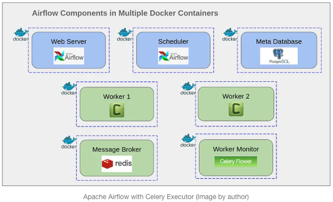

# Airflow in Docker

## References

- [Deploy Apache Airflow in Multiple Docker Containers](https://towardsdatascience.com/deploy-apache-airflow-in-multiple-docker-containers-7f17b8b3de58)
- [Running Apache Airflow via Docker Compose](https://medium.com/@davide.gazze/running-apache-airflow-via-docker-compose-bcbb19f30cd6)
- https://github.com/nishakanthiA/Airflow-Docker/blob/master/docker-compose.yml

## Postgres Container

### #( 03/23/23@12:51PM )( donbuddenbaum@donbs-imac ):~
docker ps  

```
CONTAINER ID   IMAGE                           COMMAND                  CREATED        STATUS                       PORTS                              NAMES
21a65d9b0e03   apache/airflow:2.5.2            "/usr/bin/dumb-init …"   20 hours ago   Up About an hour (healthy)   0.0.0.0:5555->5555/tcp, 8080/tcp   airflow-work-flower-1
85f8f91582de   apache/airflow:2.5.2            "/usr/bin/dumb-init …"   20 hours ago   Up About an hour (healthy)   8080/tcp                           airflow-work-airflow-triggerer-1
2c5abcacbee4   apache/airflow:2.5.2            "/usr/bin/dumb-init …"   20 hours ago   Up About an hour (healthy)   0.0.0.0:8080->8080/tcp             airflow-work-airflow-webserver-1
1027ebb835eb   apache/airflow:2.5.2            "/usr/bin/dumb-init …"   20 hours ago   Up About an hour (healthy)   8080/tcp                           airflow-work-airflow-scheduler-1
6303ff4ab7fd   apache/airflow:2.5.2            "/usr/bin/dumb-init …"   20 hours ago   Up About an hour (healthy)   8080/tcp                           airflow-work-airflow-worker-1
6dceb84f635f   postgres:13                     "docker-entrypoint.s…"   20 hours ago   Up About an hour (healthy)   5432/tcp                           airflow-work-postgres-1
20f6a247bf9d   redis:latest                    "docker-entrypoint.s…"   20 hours ago   Up About an hour (healthy)   6379/tcp                           airflow-work-redis-1
c9033ab37692   moby/buildkit:buildx-stable-1   "buildkitd"              5 days ago     Up 5 days                                                       buildx_buildkit_thirsty_hamilton0
```
### #( 03/23/23@12:51PM )( donbuddenbaum@donbs-imac ):~
docker exec -it 6dceb84f635f  bash

```
root@6dceb84f635f:/# ls
bin  boot  dev	docker-entrypoint-initdb.d  etc  home  lib  lib64  media  mnt  opt  proc  root	run  sbin  srv	sys  tmp  usr  var
```

