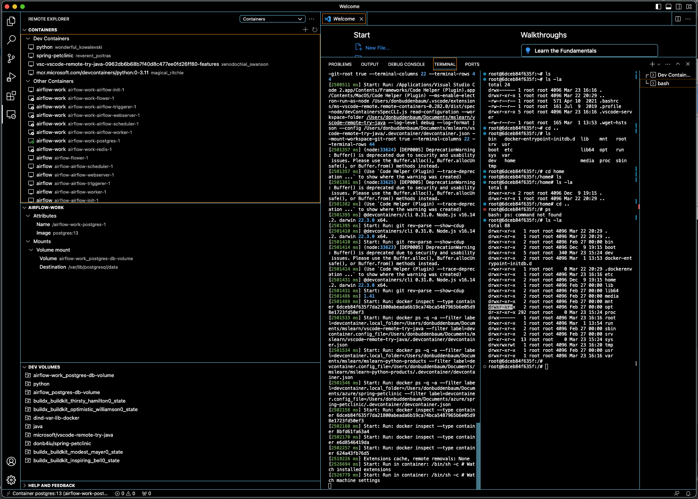
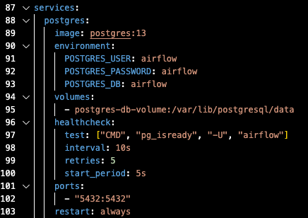
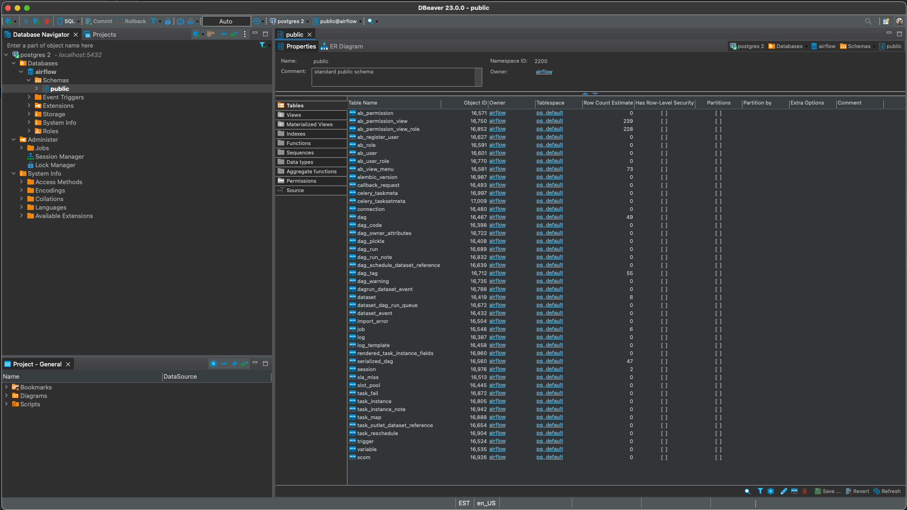

# VSCode  Dev Containers

## References

- [Visual Studio Code Dev Container Tutorial](https://github.com/0916dhkim/vscode-devcontainer-tutorial)
- [Attach to a running container](https://code.visualstudio.com/docs/devcontainers/attach-container)

## Postgres Container

expose 5432 in the docker compose postgres service to access DB outside of compose network

